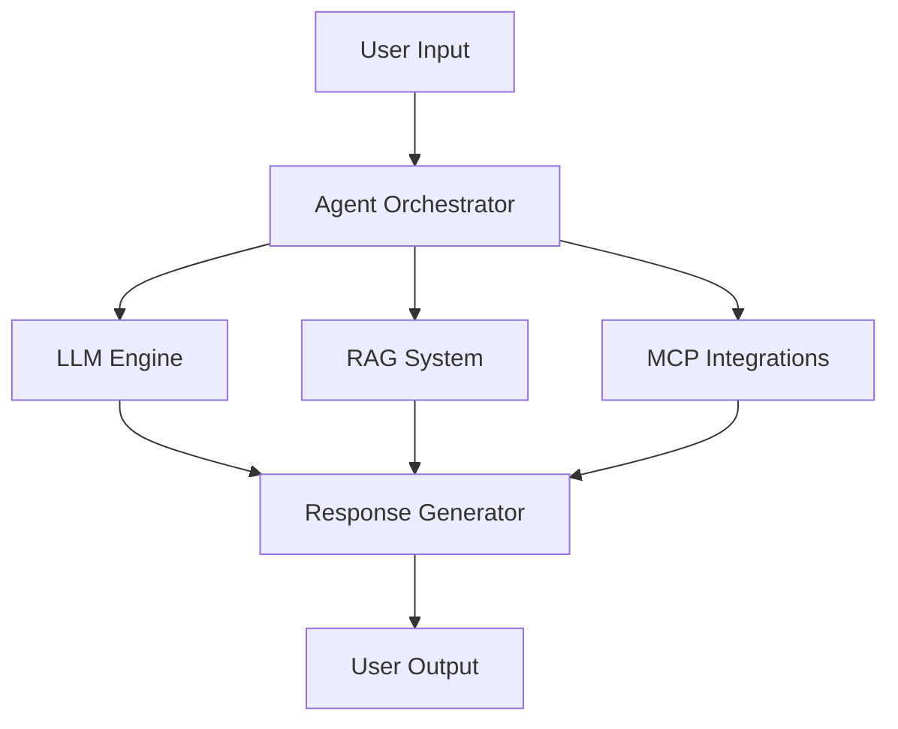

# Agents

Agents are the core building blocks of Smart AI Hub. Learn how to create, manage, and deploy intelligent agents.

## What is an Agent?

An **Agent** is an AI-powered entity that can:

- 🧠 Understand natural language
- 🎯 Make intelligent decisions
- 🔄 Execute actions across systems
- 📚 Learn from context and data
- 🔌 Integrate with external services

## Agent Architecture

### Components

1. **Agent Orchestrator** - Coordinates all agent activities
2. **LLM Engine** - Processes natural language
3. **RAG System** - Retrieves relevant context
4. **MCP Integrations** - Connects to external systems
5. **Response Generator** - Produces final output

## Agent Types

### Chat Agents
Conversational agents that interact via text.

**Use Cases:**
- Customer support
- FAQ answering
- Personal assistants

### Workflow Agents
Agents that execute multi-step workflows.

**Use Cases:**
- Data processing
- Report generation
- Automated approvals

### Integration Agents
Specialized agents for system integrations.

**Use Cases:**
- CRM synchronization
- Data migration
- API orchestration

## Agent Lifecycle

### 1. Creation
Define agent configuration, behavior, and capabilities.

### 2. Testing
Test agent in sandbox environment.

### 3. Publishing
Deploy agent for use by others.

### 4. Monitoring
Track performance and usage.

### 5. Updating
Improve agent based on feedback.

### 6. Deletion
Remove agent when no longer needed.

## Agent Registry

The **Universal Agent Registry** is a centralized catalog of all agents in your workspace.

**Features:**
- Search and discover agents
- View agent metadata
- Check version history
- Monitor usage statistics

## Example Agents

### Marketing Agent
Automates marketing tasks like content creation and social media posting.

**Capabilities:**
- Generate blog posts
- Create social media content
- Schedule posts
- Analyze engagement

### Workflow Automation Agent
Orchestrates complex business processes.

**Capabilities:**
- Multi-step workflows
- Conditional logic
- Error handling
- Notifications

### Integration Agent
Connects and syncs data between systems.

**Capabilities:**
- Bi-directional sync
- Data transformation
- Conflict resolution
- Scheduled updates

## Best Practices

1. **Clear Purpose** - Define specific use cases
2. **Focused Scope** - Keep agents specialized
3. **Good Prompts** - Write clear system prompts
4. **Test Thoroughly** - Validate before publishing
5. **Monitor Performance** - Track metrics regularly

## Next Steps

### 🚀 Dive Deeper

- **[Agent Lifecycle](/agents/lifecycle)** - Learn about the complete agent lifecycle from creation to deletion
- **[Agent Orchestrator](/agents/orchestrator)** - Understand how the orchestrator coordinates agent activities
- **[Agent Registry](/agents/registry)** - Explore the universal agent registry and discovery
- **[Agent Examples](/agents/examples)** - See real-world agent implementations and use cases