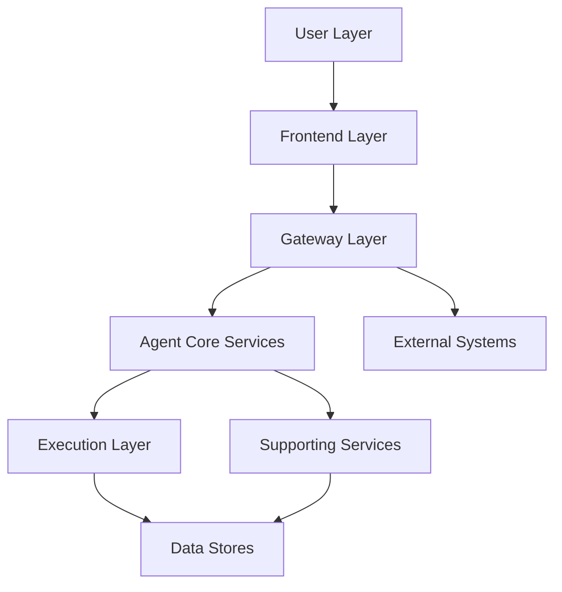
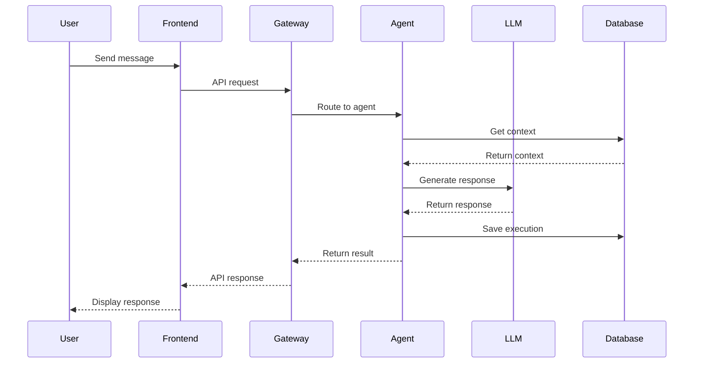
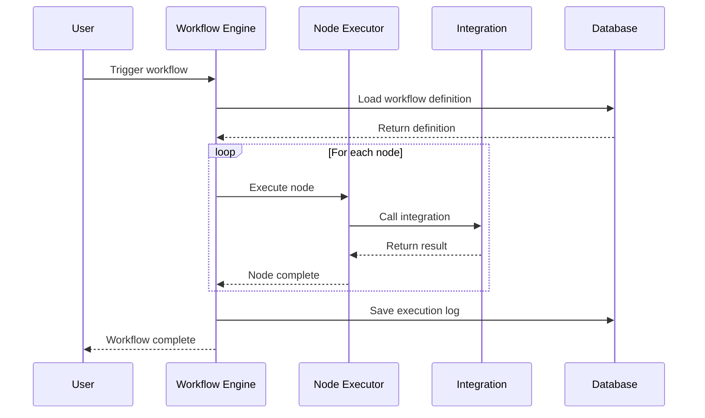
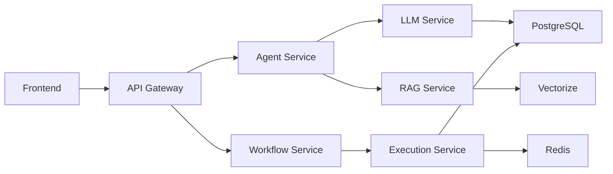

# System Architecture

Understand the technical architecture of Smart AI Hub.

## Unified Agent Architecture Overview

Smart AI Hub uses a layered architecture for scalability, maintainability, and flexibility.

## Layer-by-Layer Breakdown

### 1. User Layer
- Web browsers
- Mobile apps
- API clients
- Third-party integrations

### 2. Frontend Layer

**Components:**
- React application
- Next.js server
- Static assets
- PWA service worker

**Responsibilities:**
- User interface
- Client-side routing
- State management
- Real-time updates

### 3. Gateway Layer

**Components:**
- API Gateway
- MCP Server
- Load balancer
- Rate limiter

**Responsibilities:**
- Request routing
- Authentication
- Rate limiting
- Protocol translation

### 4. Agent Core Services

**Components:**
- Agent Orchestrator
- LLM Engine
- RAG System
- Workflow Engine

**Responsibilities:**
- Agent execution
- LLM coordination
- Context retrieval
- Workflow orchestration

### 5. Execution Layer

**Components:**
- Node executors
- Integration handlers
- Action processors
- Event handlers

**Responsibilities:**
- Execute workflows
- Handle integrations
- Process actions
- Manage events

### 6. Supporting Services

**Components:**
- Analytics service
- Monitoring service
- Logging service
- Notification service

**Responsibilities:**
- Collect metrics
- Monitor health
- Aggregate logs
- Send notifications

### 7. Data Stores

**Components:**
- PostgreSQL (relational data)
- Redis (cache)
- Cloudflare Vectorize (vectors)
- S3 (file storage)

**Responsibilities:**
- Persist data
- Cache frequently accessed data
- Store vectors
- Store files

### 8. External Systems

**Integrations:**
- LLM providers (OpenAI, Anthropic, Google)
- Third-party APIs (Slack, Notion, etc.)
- Webhooks
- OAuth providers

## Data Flow Diagram

### User Request Flow

### Workflow Execution Flow

## Internal Communication

### Service-to-Service Communication

**Protocols:**
- HTTP/REST - Synchronous requests
- gRPC - High-performance RPC
- WebSocket - Real-time updates
- Message Queue - Asynchronous processing

### Message Queue

**Technology:** Redis Pub/Sub, RabbitMQ

**Use Cases:**
- Workflow execution
- Background jobs
- Event processing
- Notifications

## Service Dependencies

## Scalability

### Horizontal Scaling
- Stateless services
- Load balancing
- Auto-scaling groups
- Database read replicas

### Vertical Scaling
- Increase instance sizes
- Optimize queries
- Cache aggressively
- Use CDN

## High Availability

### Redundancy
- Multi-AZ deployment
- Database replication
- Service redundancy
- Backup systems

### Failover
- Automatic failover
- Health checks
- Circuit breakers
- Graceful degradation

---

**Learn more:** [Developer Guide](/developers) | [API Reference](/gateway/api-reference)