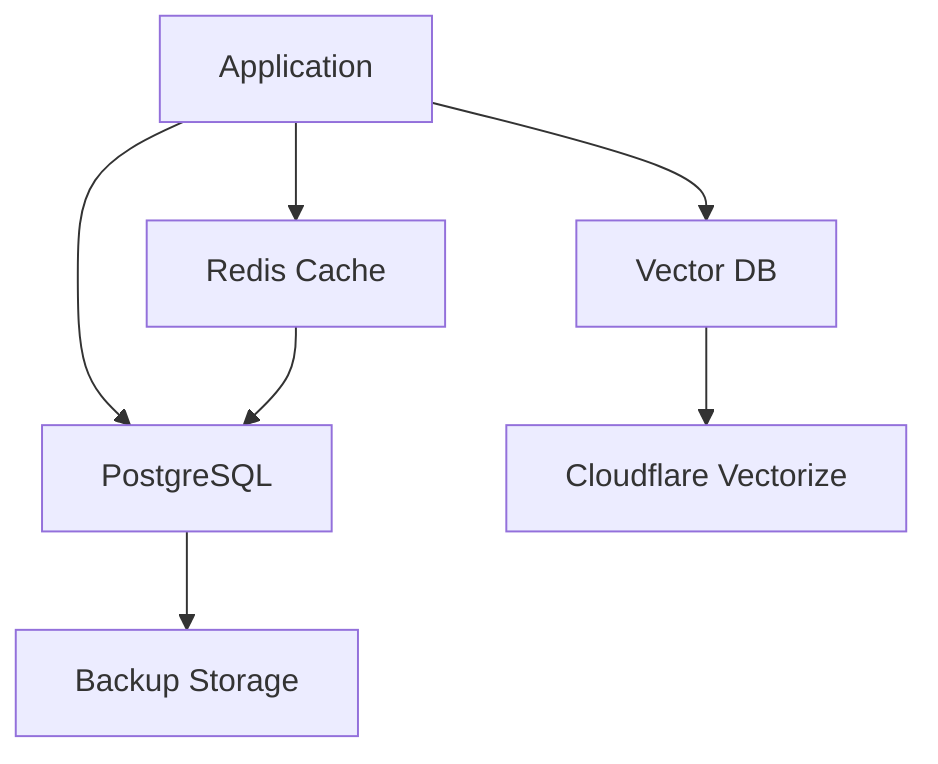

# Data & Storage

Smart AI Hub uses a multi-layered data architecture for optimal performance and reliability.

## Data Architecture Overview

## Vector Database

### Cloudflare Vectorize

High-performance vector storage for RAG:

- **Scalability** - Billions of vectors
- **Low Latency** - Global edge network
- **Cost-Effective** - Pay per query
- **Automatic Scaling** - No capacity planning

### Use Cases
- Semantic search
- Document retrieval
- Similarity matching
- Recommendation systems

## PostgreSQL Schema

Primary relational database:

### Core Tables
- `users` - User accounts
- `workspaces` - Workspace data
- `agents` - Agent definitions
- `workflows` - Workflow configurations
- `executions` - Execution logs
- `analytics` - Usage metrics

### Indexes
Optimized for:
- User lookups
- Workspace queries
- Agent searches
- Execution history

## Redis Cache

In-memory cache for performance:

### Cached Data
- Session data
- User preferences
- Agent configurations
- Frequently accessed data

### Benefits
- **Fast Access** - Sub-millisecond latency
- **Reduced Load** - Fewer database queries
- **Scalability** - Handle high traffic

## Data Retention & Security

### Retention Policies
- **Execution Logs** - 90 days
- **Analytics Data** - 1 year
- **User Data** - Indefinite (until deletion)
- **Backups** - 30 days

### Security Measures
- **Encryption at Rest** - AES-256
- **Encryption in Transit** - TLS 1.3
- **Access Control** - RBAC
- **Audit Logs** - All data access logged
- **Compliance** - GDPR, SOC 2, ISO 27001